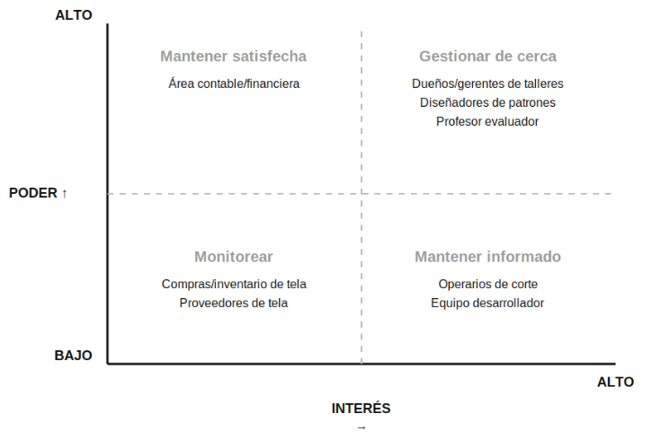

# Taller: Interesados de nuestro proyecto

**Proyecto:** Sistema Inteligente de Gestión de Mermas y Optimización de Corte Textil mediante IA  
**Estudiantes:** María Jimena Jara Rojas y María Fernanda Sibaja Campos  
**Curso:** ISW-912 Administración de Proyectos Informáticos, III Cuatrimestre 2026

## Identificación y registro de interesados

Para el registro utilizamos una escala de **1 a 5** para poder e interés. Consideramos **1 a 3 como bajo** y **4 a 5 como alto**.

| Interesado | Rol / relación | Necesidad | Poder | Interés | Actitud | Estrategia |
|---|---|---|---:|---:|---|---|
| Dueños/gerentes de talleres y empresas de confección | Clientes y posibles usuarios decisores | Reducir el desperdicio de tela y bajar costos de producción | 5 | 5 | Favorable | Gestionar de cerca |
| Diseñadores de patrones / patronistas | Usuarios especializados del sistema | Que el sistema interprete correctamente sus patrones, incluidas las formas irregulares | 4 | 5 | Favorable | Gestionar de cerca |
| Profesor evaluador | Evaluador del proyecto | Que el proyecto cumpla los objetivos y la metodología del curso | 5 | 4 | Neutral | Gestionar de cerca |
| Operarios de corte | Usuarios del resultado del sistema | Recibir instrucciones de distribución claras y aplicables en planta | 2 | 4 | Mixta | Mantener informado |
| Equipo desarrollador (nosotras) | Responsables del desarrollo | Mantener un alcance manejable durante el tiempo disponible del curso | 3 | 5 | Favorable | Mantener informado |
| Área contable/financiera del cliente | Área que revisa el impacto económico | Ver el ahorro real en material y valorar la inversión | 4 | 2 | Neutral | Mantener satisfecha |
| Encargados de compras/inventario de tela | Responsables de controlar materiales | Registrar correctamente los rollos de tela disponibles | 2 | 3 | Neutral | Monitorear |
| Proveedores de tela | Proveedores externos relacionados con el material | Mantener su volumen de venta | 1 | 2 | Neutral | Monitorear |

## Justificación de los casos discutibles

No todos los valores fueron evidentes desde el inicio. Estos fueron los casos que más tuvimos que analizar:

- **Diseñadores de patrones (poder 4):** al inicio pensamos asignarles menos poder porque no son quienes pagan por el sistema. Sin embargo, su participación es importante porque un patrón mal cargado o que el sistema no interprete correctamente puede afectar el resultado de la optimización. Por eso consideramos que tienen un poder alto dentro de la operación del sistema.
- **Equipo desarrollador (poder 3, interés 5):** el interés es alto porque somos responsables directamente del desarrollo. El poder se mantiene en un nivel medio porque las decisiones importantes de alcance también dependen de los requisitos del curso y de las condiciones del proyecto.
- **Área contable/financiera (interés 2):** aunque el proyecto busca reducir costos, esta área no participa constantemente en el desarrollo. Su participación sería más importante al analizar presupuesto, ahorro o resultados económicos.
- **Proveedores de tela (poder 1):** podrían verse afectados si disminuye el desperdicio y, por lo tanto, cambia el consumo de tela. Sin embargo, no tienen capacidad directa para aprobar, modificar o bloquear las decisiones del proyecto.

## Mapa Poder-Interés

El mapa utiliza la misma escala de 1 a 5. Para definir los cuadrantes consideramos de **1 a 3 como bajo** y de **4 a 5 como alto**.

	

## Preguntas de análisis del grupo

### ¿A quién debemos involucrar primero?

Debemos involucrar primero a los **dueños o gerentes de talleres y empresas de confección**, porque pueden validar si el sistema realmente responde al problema que se quiere resolver. También es importante involucrar desde el inicio a los **diseñadores de patrones**, ya que conocen directamente los tipos de patrones y las dificultades que el sistema debe manejar.

### ¿Quién puede bloquear una decisión?

Los **dueños o gerentes** y el **profesor evaluador** tienen capacidad para condicionar decisiones importantes. Los primeros pueden decidir si el sistema resulta útil para su operación, mientras que el profesor establece los criterios que debe cumplir el proyecto dentro del curso.

### ¿Quién necesita información frecuente?

Los **dueños o gerentes**, los **diseñadores de patrones**, el **profesor evaluador** y el **equipo desarrollador** necesitan información frecuente sobre avances, pruebas y cambios. Los operarios también deben recibir información cuando existan cambios que afecten las instrucciones de corte.

### ¿Qué interesado estamos subestimando?

Consideramos que los **operarios de corte** podrían ser el interesado que más fácilmente se subestima. Aunque tienen un poder menor, son quienes podrían utilizar directamente las instrucciones generadas por el sistema. Si estas no son claras o prácticas, el resultado puede ser difícil de aplicar en la operación real.

### ¿Qué conflicto de expectativas puede aparecer?

Puede aparecer un conflicto entre la necesidad de los **dueños o gerentes de obtener ahorro y resultados** y las limitaciones del **equipo desarrollador**, especialmente por el tiempo disponible para desarrollar y probar la inteligencia artificial. También puede existir una diferencia entre lo que los **patronistas** esperan que el sistema interprete y lo que técnicamente sea posible implementar dentro del alcance del curso.

## Los tres interesados críticos

### 1. Dueños/gerentes de talleres y empresas de confección

Son quienes pueden validar el valor práctico del sistema y decidir si resulta útil para su operación. Planeamos involucrarlos mediante demostraciones periódicas del prototipo, recopilando retroalimentación sobre las funciones y verificando que el sistema responda al problema del desperdicio de tela.

### 2. Diseñadores de patrones / patronistas

Participan directamente en una de las partes más importantes del sistema. Realizaremos pruebas con patrones reales, incluyendo formas irregulares, y solicitaremos retroalimentación sobre las diferentes formas de cargar o representar los patrones, como archivos DXF/SVG, fotografías o dibujo.

### 3. Profesor evaluador

Sus criterios son importantes porque el proyecto debe cumplir con los objetivos y metodología establecidos para el curso. Planeamos mostrar avances en las entregas correspondientes y consultar oportunamente cuando existan dudas sobre el alcance o la metodología.

## ¿Predictivo, adaptativo o híbrido?

El proyecto se gestionará con un enfoque **híbrido**.   

El alcance general fue definido desde el Trabajo #1 y el curso tiene una fecha de entrega establecida. Por esta razón, algunas partes pueden planificarse anticipadamente, como los módulos relacionados con tela, patrones y órdenes de producción.

Sin embargo, el módulo de optimización presenta mayor incertidumbre. El algoritmo genético, la heurística de colocación y la visión por computadora para interpretar patrones a partir de una fotografía requieren pruebas, ajustes y retroalimentación. Es posible que debamos modificar algunos aspectos conforme obtengamos resultados de las pruebas con distintos tipos de piezas.

Por estas características, el enfoque híbrido se adapta al contexto del proyecto: permite mantener una planificación estable para los elementos definidos y, al mismo tiempo, utilizar ciclos de prueba y adaptación en las partes que presentan mayor incertidumbre.