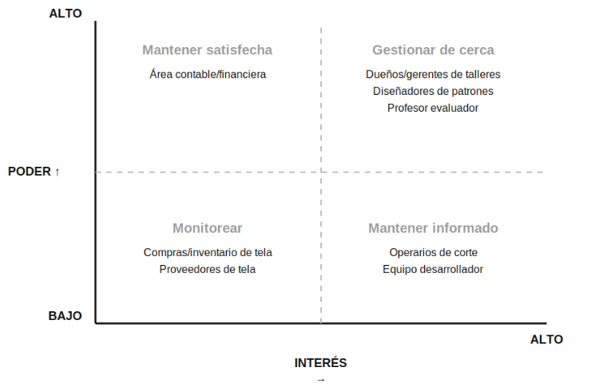

# Sistema Inteligente de Gestión de Mermas y Optimización de Corte Textil mediante IA

**Curso:** ISW-912 Administración de Proyectos Informáticos  
**Periodo:** III Cuatrimestre 2026  
**Proyecto:** Optimización del corte textil y reducción del desperdicio de tela

**Estudiantes:** María Jimena Jara Rojas y María Fernanda Sibaja Campos  
**Profesor:** Deiver Cubero Molina  
**Sede:** Sede Regional de San Carlos

## Historial de versiones

| Versión | Semana | Fecha | Descripción |
|---|---|---|---|
| 1.0 | Clase 1 | 16/09/2026 | Presentación de la idea inicial del proyecto y preparación del repositorio para organizar la documentación del trabajo. |
| 2.0 | Clase 2 | 23/09/2026 | Desarrollo de la definición del proyecto, con una descripción del problema, la solución propuesta y los objetivos que orientan su desarrollo. |
| 3.0 | Clase 3 | 30/09/2026 | Identificación y análisis de los interesados del proyecto, considerando su participación e influencia, e integración de los avances en la documentación. |
| 4.0 | Clase 4 | 07/10/2026 | Definición de la organización y las responsabilidades del equipo, junto con el análisis de los factores del entorno que pueden influir en el proyecto. |

## Contenido

- [Historial de versiones](#historial-de-versiones)
- [Definición del proyecto](#trabajo-1-definición-del-proyecto)
- [Taller de interesados del proyecto](#trabajo-2-taller-de-interesados-del-proyecto)
- [Definición del Scrum Team](#definición-del-scrum-team)
- [Análisis de entorno](#análisis-de-entorno-eefs-e-interesados)

---

## Definición del proyecto

**Fecha:** 23 de septiembre de 2026

### Tema/Nombre

Sistema Inteligente de Gestión de Mermas y Optimización de Corte Textil mediante IA

### Estudiantes

María Jimena Jara Rojas y María Fernanda Sibaja Campos

### Problema

Las empresas y negocios dedicados a la confección de prendas necesitan utilizar grandes cantidades de tela para fabricar diferentes productos. Una distribución poco eficiente de los patrones durante el proceso de corte puede generar desperdicio de material, aumentar los costos de producción y dificultar el control sobre la cantidad de tela utilizada.

Actualmente, la planificación del corte puede realizarse de manera manual o mediante herramientas que no siempre consideran de forma integral las dimensiones de la tela, las cantidades requeridas, los diferentes tamaños de las prendas y las características de los patrones. Esto puede provocar un mayor porcentaje de material sobrante y dificultar la toma de decisiones antes de iniciar la producción.

El problema puede presentarse tanto en empresas de confección de gran volumen como en emprendimientos, marcas de ropa y negocios que producen cantidades menores de prendas.

### Proyecto propuesto

#### Descripción general

Desarrollar una plataforma web adaptable a dispositivos móviles que permita gestionar y optimizar el uso de tela durante la planificación de producción de prendas.

El sistema permitirá registrar los rollos de tela disponibles, sus dimensiones, características y cantidades requeridas para una producción. También permitirá cargar o registrar los patrones de las prendas y las cantidades necesarias de cada pieza.

Mediante algoritmos de optimización e Inteligencia Artificial (principalmente un algoritmo genético, apoyado en cálculos geométricos y en una heurística de colocación), el sistema analizará diferentes posibilidades de distribución de los patrones sobre la tela y propondrá una alternativa que busque maximizar el aprovechamiento del material y reducir el desperdicio.

#### Visualización de resultados

La plataforma mostrará visualmente la distribución propuesta y proporcionará información como:

- Cantidad de tela requerida.
- Porcentaje de aprovechamiento.
- Cantidad estimada de desperdicio.
- Cantidad de prendas que pueden producirse.
- Comparación entre diferentes alternativas de distribución.
- Estimación del costo asociado al material desperdiciado.
- Historial de producciones y desperdicios.

#### Usuarios de la plataforma

Además, contará con diferentes tipos de usuarios para permitir que pueda ser utilizada por emprendimientos, marcas de ropa, talleres y empresas de confección de mayor escala.

#### Registro de prendas y patrones

Cuando un cliente nuevo quiere agregar una prenda que el sistema aún no conoce, el sistema no depende de un catálogo cerrado. Cada pieza de la prenda se representa internamente como un contorno geométrico (un polígono con muchos puntos), lo que permite manejar desde un rectángulo hasta una forma curva, asimétrica o irregular. Para que cualquier cliente pueda cargar sus prendas, el sistema ofrece cuatro métodos:

##### Métodos de carga

- Plantillas con medidas. Para formas comunes (rectángulos, trapecios, círculos, mangas, cuellos, bolsillos), el usuario elige una plantilla e ingresa las medidas. Es el método más rápido para prendas sencillas.
- Importación de archivos de patrones. Si el cliente ya diseña sus patrones en programas de patronaje o diseño (como los que exportan archivos DXF o SVG), los sube directamente y el sistema extrae el contorno de cada pieza. Es el método más exacto para formas complejas.
- Fotografía o escaneo del patrón en papel. Para talleres y emprendimientos que usan moldes de papel, el usuario coloca el molde sobre un fondo que contraste, junto a una regla o marca de referencia, y lo fotografía con el celular. Un módulo de visión por computadora detecta el contorno, lo convierte a las medidas reales usando la referencia y lo muestra al usuario para que lo revise y ajuste.
- Editor de dibujo. El usuario dibuja la pieza con puntos y curvas, o corrige un contorno importado o detectado. Permite crear formas exóticas desde cero o ajustar detalles.

##### Proceso de registro

Sea cual sea el método, el proceso para agregar una prenda nueva sigue estos pasos:

1. El cliente crea la prenda (nombre, tipo y tallas) y agrega cada una de sus piezas por alguno de los cuatro métodos.
2. El sistema valida la geometría de cada pieza: que el contorno esté cerrado, que no se cruce consigo mismo, que la escala sea correcta y que la pieza quepa en el ancho de la tela disponible. Si hay un problema, muestra un mensaje claro para corregirlo.
3. El cliente indica las restricciones de cada pieza: dirección del hilo, rotaciones permitidas (ninguna, 180 grados o libre), margen de costura, si la pieza se corta en espejo (izquierda y derecha) y si la tela tiene sentido, pelo o estampado.
4. El cliente define las cantidades por pieza y por talla. Para otras tallas, puede cargar cada talla o aplicar una regla de escalado (gradación) sobre la talla base.
5. El sistema muestra una vista previa de las piezas y ejecuta una prueba de distribución sobre una tela de ejemplo para confirmar que la prenda funciona.
6. El cliente aprueba la prenda y esta se guarda en su biblioteca, con control de versiones, para reutilizarla en futuras órdenes de producción sin volver a cargarla.

##### Formas y características admitidas

El sistema debe soportar los siguientes tipos de formas y características:

- Formas rectas y geométricas: rectángulos, trapecios y triángulos.
- Formas curvas: cuellos, sisas, mangas, bajos redondeados y círculos completos o medios círculos.
- Formas cóncavas y asimétricas, con entradas y salidas en el contorno.
- Formas con huecos internos, por ejemplo una abertura dentro de la pieza.
- Piezas simétricas o en espejo, y piezas con dirección de hilo obligatoria.
- Piezas con estampado o cuadros que deben coincidir entre sí.
- Formas exóticas o de diseño (capas, volantes, cortes en espiral, drapeados), que se manejan como contornos irregulares.

El algoritmo de distribución trabaja con estos contornos reales, sin simplificarlos a cajas rectangulares, y considera las restricciones definidas para cada pieza. La Inteligencia Artificial (el algoritmo genético) interviene en la búsqueda y recomendación de las mejores alternativas de distribución; la detección del contorno a partir de fotografías se realiza con técnicas de visión por computadora.

#### Método de optimización: cómo se acomodan las piezas en la tela

Acomodar piezas irregulares sobre una tela sin desperdiciar es un problema conocido como nesting (empaquetado bidimensional de formas irregulares). No tiene una solución exacta que se calcule en un tiempo razonable, por lo que se resuelve con heurísticas y metaheurísticas, que son técnicas de Inteligencia Artificial clásica. El sistema propone una solución de buena calidad, no necesariamente la óptima, y la compara con otras alternativas. La solución se organiza en cuatro capas:

- Geometría de las piezas. Cada pieza es un polígono. Para saber si dos piezas pueden estar juntas sin traslaparse, se usa el No-Fit Polygon (NFP), que calcula todas las posiciones en las que una pieza toca a otra sin invadirla. Se puede implementar con librerías de geometría como Shapely y pyclipper.
- Colocación de las piezas. Dados un orden y una rotación para cada pieza, el sistema las coloca una por una con la heurística Bottom-Left: cada pieza se ubica lo más abajo y a la izquierda posible dentro del ancho del rollo. Esto genera una distribución completa, cuya calidad depende del orden y de las rotaciones elegidas.
- Búsqueda de la mejor distribución con un algoritmo genético. Este es el componente principal de Inteligencia Artificial. Funciona así:
  - Cromosoma: el orden de las piezas y la rotación de cada una (por ejemplo, 0 o 180 grados cuando la tela tiene dirección).
  - Aptitud (fitness): el porcentaje de aprovechamiento de la tela o, equivalentemente, el largo de tela consumido. Mientras menos tela se use, mejor es la solución.
  - Proceso: se genera una población de distribuciones al azar, se evalúa cada una con la colocación Bottom-Left, se combinan las mejores (cruce), se introducen cambios aleatorios (mutación) y se repite durante muchas generaciones hasta que la mejora se estabiliza.
  - Herramientas: la librería DEAP de Python para el algoritmo genético. Existen proyectos abiertos de nesting, como SVGnest y Deepnest, que usan un enfoque similar (NFP más algoritmo genético), lo que respalda la viabilidad de la técnica. Como alternativas de la misma familia se pueden evaluar el recocido simulado y la búsqueda tabú.

#### Tipo de Inteligencia Artificial utilizada

La Inteligencia Artificial de este proyecto es de tipo búsqueda y optimización (computación evolutiva), una rama reconocida de la IA. No se utilizan modelos de lenguaje ni redes neuronales, y el algoritmo genético no requiere datos de entrenamiento: optimiza cada orden de producción desde cero, lo que lo hace adecuado para un problema donde cada caso es distinto. El aprendizaje automático con datos históricos queda como una ampliación futura, una vez que el sistema haya acumulado información de producciones.

##### Visión por computadora y ampliaciones futuras

Para cargar patrones desde una fotografía se utiliza OpenCV (segmentación y detección de contornos), y como opción más avanzada un modelo de segmentación. En una etapa posterior, con el historial de producciones, un modelo de aprendizaje automático podría predecir el desperdicio esperado o sugerir un buen orden inicial para prendas similares.

#### Evaluación de resultados

Se comparará el porcentaje de aprovechamiento obtenido por el algoritmo genético contra una línea base simple (colocar las piezas de mayor a menor sin optimizar) y contra un acomodo manual, usando los mismos patrones y la misma tela. También se podrán utilizar conjuntos de datos públicos de referencia para este tipo de problema, como los del grupo ESICUP, para comparar con resultados conocidos.

### Valor esperado

Se espera proporcionar una herramienta que facilite la planificación del corte textil, permita tomar decisiones basadas en datos y contribuya a disminuir el desperdicio de tela.

El sistema también permitirá llevar un mejor control del consumo de materiales y generar información histórica que ayude a identificar patrones de desperdicio y oportunidades de mejora.

A largo plazo, la plataforma podría ampliarse con módulos de gestión de producción, control de inventario, control de calidad mediante visión artificial, cálculo de costos, proveedores y conexión entre empresas que requieren producción y empresas que ofrecen capacidad de confección.

### Objetivos

#### Objetivo general

Desarrollar una plataforma web para la planificación y optimización del corte de patrones textiles, utilizando un algoritmo genético como técnica de Inteligencia Artificial, con el propósito de mejorar el aprovechamiento de la tela y reducir el desperdicio durante la producción de prendas.

#### Objetivos específicos

- Diseñar e implementar una plataforma web adaptable a dispositivos móviles que permita registrar y gestionar rollos de tela, prendas, patrones y órdenes de producción, considerando las dimensiones y restricciones necesarias para el proceso de corte.
- Desarrollar un módulo de optimización basado en un algoritmo genético, apoyado en cálculos geométricos y una heurística de colocación, que genere y visualice diferentes distribuciones de patrones sobre la tela y permita calcular el porcentaje de aprovechamiento, el desperdicio y el consumo estimado de material.
- Evaluar el funcionamiento del sistema mediante casos de prueba con diferentes patrones, cantidades y dimensiones de tela, comparando los resultados obtenidos mediante el algoritmo de optimización con una línea base de distribución y, cuando sea posible, con un acomodo manual.

---

## Taller de interesados del proyecto

### Identificación y registro de interesados

Para el registro utilizamos una escala de **1 a 5** para poder e interés. Consideramos **1 a 3 como bajo** y **4 a 5 como alto**.

| Interesado | Rol / relación | Necesidad | Poder | Interés | Actitud | Estrategia |
|---|---|---|---:|---:|---|---|
| Dueños/gerentes de talleres y empresas de confección | Clientes y posibles usuarios decisores | Reducir el desperdicio de tela y bajar costos de producción | 5 | 5 | Favorable | Gestionar de cerca |
| Diseñadores de patrones / patronistas | Usuarios especializados del sistema | Que el sistema interprete correctamente sus patrones, incluidas las formas irregulares | 4 | 5 | Favorable | Gestionar de cerca |
| Profesor evaluador | Evaluador del proyecto | Que el proyecto cumpla los objetivos y la metodología del curso | 5 | 4 | Neutral | Gestionar de cerca |
| Operarios de corte | Usuarios del resultado del sistema | Recibir instrucciones de distribución claras y aplicables en planta | 2 | 4 | Mixta | Mantener informado |
| Equipo desarrollador (nosotras) | Responsables del desarrollo | Mantener un alcance manejable durante el tiempo disponible del curso | 3 | 5 | Favorable | Mantener informado |
| Área contable/financiera del cliente | Área que revisa el impacto económico | Ver el ahorro real en material y valorar la inversión | 4 | 2 | Neutral | Mantener satisfecha |
| Encargados de compras/inventario de tela | Responsables de controlar materiales | Registrar correctamente los rollos de tela disponibles | 2 | 3 | Neutral | Monitorear |
| Proveedores de tela | Proveedores externos relacionados con el material | Mantener su volumen de venta | 1 | 2 | Neutral | Monitorear |

### Justificación de los casos discutibles

No todos los valores fueron evidentes desde el inicio. Estos fueron los casos que más tuvimos que analizar:

- **Diseñadores de patrones (poder 4):** al inicio pensamos asignarles menos poder porque no son quienes pagan por el sistema. Sin embargo, su participación es importante porque un patrón mal cargado o que el sistema no interprete correctamente puede afectar el resultado de la optimización. Por eso consideramos que tienen un poder alto dentro de la operación del sistema.
- **Equipo desarrollador (poder 3, interés 5):** el interés es alto porque somos responsables directamente del desarrollo. El poder se mantiene en un nivel medio porque las decisiones importantes de alcance también dependen de los requisitos del curso y de las condiciones del proyecto.
- **Área contable/financiera (interés 2):** aunque el proyecto busca reducir costos, esta área no participa constantemente en el desarrollo. Su participación sería más importante al analizar presupuesto, ahorro o resultados económicos.
- **Proveedores de tela (poder 1):** podrían verse afectados si disminuye el desperdicio y, por lo tanto, cambia el consumo de tela. Sin embargo, no tienen capacidad directa para aprobar, modificar o bloquear las decisiones del proyecto.

### Mapa Poder-Interés

El mapa utiliza la misma escala de 1 a 5. Para definir los cuadrantes consideramos de **1 a 3 como bajo** y de **4 a 5 como alto**.

	

Distribución por cuadrante:

| Cuadrante | Estrategia | Interesados |
|---|---|---|
| Poder alto, interés alto | Gestionar de cerca | Dueños/gerentes de talleres, diseñadores de patrones, profesor evaluador |
| Poder alto, interés bajo | Mantener satisfecha | Área contable/financiera |
| Poder bajo, interés alto | Mantener informado | Operarios de corte, equipo desarrollador |
| Poder bajo, interés bajo | Monitorear | Compras/inventario de tela, proveedores de tela |

### Preguntas de análisis del grupo

#### ¿A quién debemos involucrar primero?

Debemos involucrar primero a los **dueños o gerentes de talleres y empresas de confección**, porque pueden validar si el sistema realmente responde al problema que se quiere resolver. También es importante involucrar desde el inicio a los **diseñadores de patrones**, ya que conocen directamente los tipos de patrones y las dificultades que el sistema debe manejar.

#### ¿Quién puede bloquear una decisión?

Los **dueños o gerentes** y el **profesor evaluador** tienen capacidad para condicionar decisiones importantes. Los primeros pueden decidir si el sistema resulta útil para su operación, mientras que el profesor establece los criterios que debe cumplir el proyecto dentro del curso.

#### ¿Quién necesita información frecuente?

Los **dueños o gerentes**, los **diseñadores de patrones**, el **profesor evaluador** y el **equipo desarrollador** necesitan información frecuente sobre avances, pruebas y cambios. Los operarios también deben recibir información cuando existan cambios que afecten las instrucciones de corte.

#### ¿Qué interesado estamos subestimando?

Consideramos que los **operarios de corte** podrían ser el interesado que más fácilmente se subestima. Aunque tienen un poder menor, son quienes podrían utilizar directamente las instrucciones generadas por el sistema. Si estas no son claras o prácticas, el resultado puede ser difícil de aplicar en la operación real.

#### ¿Qué conflicto de expectativas puede aparecer?

Puede aparecer un conflicto entre la necesidad de los **dueños o gerentes de obtener ahorro y resultados** y las limitaciones del **equipo desarrollador**, especialmente por el tiempo disponible para desarrollar y probar la inteligencia artificial. También puede existir una diferencia entre lo que los **patronistas** esperan que el sistema interprete y lo que técnicamente sea posible implementar dentro del alcance del curso.

### Los tres interesados críticos

#### 1. Dueños/gerentes de talleres y empresas de confección

Son quienes pueden validar el valor práctico del sistema y decidir si resulta útil para su operación. Planeamos involucrarlos mediante demostraciones periódicas del prototipo, recopilando retroalimentación sobre las funciones y verificando que el sistema responda al problema del desperdicio de tela.

#### 2. Diseñadores de patrones / patronistas

Participan directamente en una de las partes más importantes del sistema. Realizaremos pruebas con patrones reales, incluyendo formas irregulares, y solicitaremos retroalimentación sobre las diferentes formas de cargar o representar los patrones, como archivos DXF/SVG, fotografías o dibujo.

#### 3. Profesor evaluador

Sus criterios son importantes porque el proyecto debe cumplir con los objetivos y metodología establecidos para el curso. Planeamos mostrar avances en las entregas correspondientes y consultar oportunamente cuando existan dudas sobre el alcance o la metodología.

### ¿Predictivo, adaptativo o híbrido?

El proyecto se gestionará con un enfoque **híbrido**.   

El alcance general fue definido desde el Trabajo #1 y el curso tiene una fecha de entrega establecida. Por esta razón, algunas partes pueden planificarse anticipadamente, como los módulos relacionados con tela, patrones y órdenes de producción.

Sin embargo, el módulo de optimización presenta mayor incertidumbre. El algoritmo genético, la heurística de colocación y la visión por computadora para interpretar patrones a partir de una fotografía requieren pruebas, ajustes y retroalimentación. Es posible que debamos modificar algunos aspectos conforme obtengamos resultados de las pruebas con distintos tipos de piezas.

Por estas características, el enfoque híbrido se adapta al contexto del proyecto: permite mantener una planificación estable para los elementos definidos y, al mismo tiempo, utilizar ciclos de prueba y adaptación en las partes que presentan mayor incertidumbre.

---

## Definición del Scrum Team

| Rol | Integrante asignada (propuesta) | Responsabilidades durante las 14 semanas |
|---|---|---|
| Product Owner | María Jimena Jara Rojas | Definir y comunicar la meta del producto, ordenar el Product Backlog y priorizar las funciones según las necesidades de los usuarios y el tiempo disponible |
| Scrum Master | María Fernanda Sibaja Campos | Promover la aplicación de Scrum, facilitar los eventos cuando sea necesario, ayudar a resolver impedimentos y apoyar la mejora de la efectividad del equipo |
| Developers | María Jimena Jara Rojas y María Fernanda Sibaja Campos | Analizar, diseñar, programar, integrar, probar y documentar la solución; organizar el trabajo técnico para alcanzar la meta de cada Sprint y asegurar la calidad del incremento |

## Análisis de entorno (EEFs)

### Factores ambientales que impactan el proyecto

| Factor ambiental | Condición conocida o por verificar | Impacto en la solución | Respuesta prevista |
|---|---|---|---|
| Calendario y requisitos académicos | El trabajo se realizará durante las 14 semanas del curso; confirmar fechas y criterios de evaluación | Limitan el tiempo y condicionan los entregables | Priorizar las funciones y ajustar la planificación al calendario oficial |
| Infraestructura tecnológica disponible | Verificar capacidad de las computadoras, conexión y alojamiento disponible | Puede limitar la ejecución del algoritmo genético y las demostraciones | Realizar pruebas de rendimiento en los equipos disponibles y evaluar ejecución local |
| Acceso a usuarios del sector textil | Confirmar disponibilidad de dueños, patronistas y operarios para entrevistas y pruebas | Condiciona la validación de necesidades y resultados | Coordinar su participación y documentar las limitaciones si no se consigue acceso |
| Disponibilidad y uso de patrones | Confirmar formatos, medidas y permisos para utilizar patrones reales | Determina los casos de prueba y las posibilidades de publicar ejemplos | Utilizar material autorizado o casos sintéticos identificados como tales |
| Cultura y procesos del taller | Investigar cómo se planifican los cortes y la disposición a incorporar herramientas digitales | Influye en la facilidad de uso y aceptación del sistema | Validar el flujo de trabajo con usuarios antes de asumir necesidades específicas |
| Distribución geográfica y conectividad | Modalidad de trabajo del equipo y ubicación de los usuarios por confirmar | Puede dificultar coordinación, entrevistas y demostraciones | Acordar canales de comunicación y alternativas de reunión |
| Privacidad y confidencialidad | Verificar las condiciones aplicables a datos personales y patrones comerciales que se compartan | Puede restringir acceso, almacenamiento y publicación de información | Minimizar datos y acordar permisos antes de incorporar información del taller |
| Recursos económicos y licencias disponibles | Presupuesto y acceso a servicios por confirmar | Condicionan herramientas, alojamiento y despliegue | Priorizar recursos disponibles y evaluar costos antes de contratar servicios |
